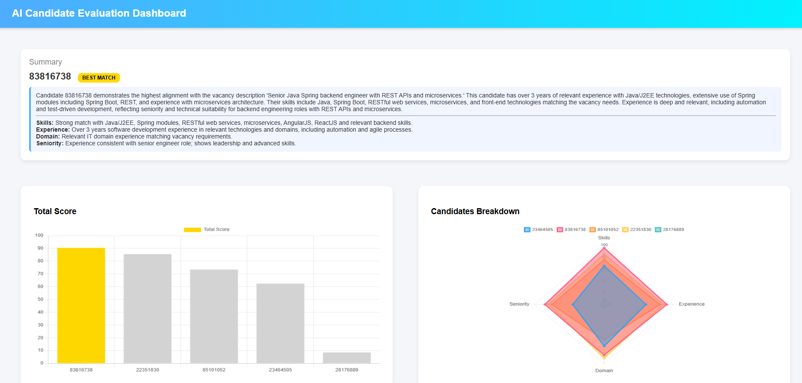

# Resume Analysis RAG Dashboard

## Description
GenAI application that analyzes resume documents, extracts candidate insights, and visualizes the result.


This implementation uses:

- **GenAI / LLM:** Azure OpenAI (`openai` SDK)
- **RAG Vector Store:** Chroma Cloud (`chromadb`)
- **Data ingestion:** CSV resume corpus
- **Visualization:** HTML + Chart.js dashboard

## Requirements

### 1) Analyze documents and extract + visualize data

Implemented:

- Resume corpus is ingested into a vector collection and retrieved by semantic query.
- Top candidates are analyzed by LLM with scoring per category:
  - `skillsMatch`
  - `experience`
  - `domain`
  - `seniority`
- Best candidate and per-candidate results are exported to JSON.
- Dashboard visualizations:
  - **Bar chart** for total weighted score
  - **Radar chart** for per-category score breakdown
  - Best-match summary with per-category reasoning

Main files:

- `src/task2/app/main.ts`
- `src/task2/core/ingest.ts`
- `src/task2/core/retrieve.ts`
- `src/task2/core/qa.ts`
- `src/task2/ui/index.html`
- `src/task2/ui/dashboard.js`

### 2) At least one evaluation metric with small dataset

Implemented:

- Evaluation dataset with multiple labeled test queries:
  - `src/task2/tests/evalDataset.ts`
- Metrics scripts:
  - **Precision**: `src/task2/tests/precisionByCategory.ts`
  - **Recall**: `src/task2/tests/recallAtK.ts`
  - **Groundedness**: `src/task2/tests/groundedness.ts`
  - **Faithfulness**: `src/task2/tests/faithfulness.ts`
- Unified runner:
  - `src/task2/tests/runAllTests.ts`

## Optional (Ninja) Challenges

### Corpus update handling w/o Vector DB rebuild

Implemented in `src/task2/core/ingest.ts`:

- Incremental sync based on content hash
- Upsert only changed/new records
- Delete removed records
- Persist state file: `src/task2/output/corpus-state.json`

### Access control aware RAG

Implemented in retrieval API:

- `retrieve(query, k, categories?)` accepts allowed category list
- Uses vector-store filter (`$in`) to emulate user access scope
- Used in `src/task2/app/main.ts` via hardcoded `allowedCategories`

### Evaluate RAG: precision, recall, faithfulness/groundedness

Implemented:

- Precision, Recall, Faithfulness scripts
- All-in-one execution script

## Datasets

- Resume corpus (local CSV):
  - `src/task2/data/resume.csv`
- Evaluation set (labeled test prompts):
  - `src/task2/tests/evalDataset.ts`

## How to Run

### 1) Generate analysis output JSON

```bash
npx ts-node src/task2/app/main.ts
```

Output files:

- `src/task2/output/data.json`
- `src/task2/output/corpus-state.json`

### 2) Open dashboard

Open in browser:

- `src/task2/ui/index.html`

The dashboard reads:

- `src/task2/output/data.json`

### 3) Run evaluation metrics

`src/task2/tests/runAllTests.ts`


## Environment Variables

Required in `.env`:

- `OPENAI_API_KEY`
- `CHROMA_API_KEY`
- `CHROMA_TENANT`
